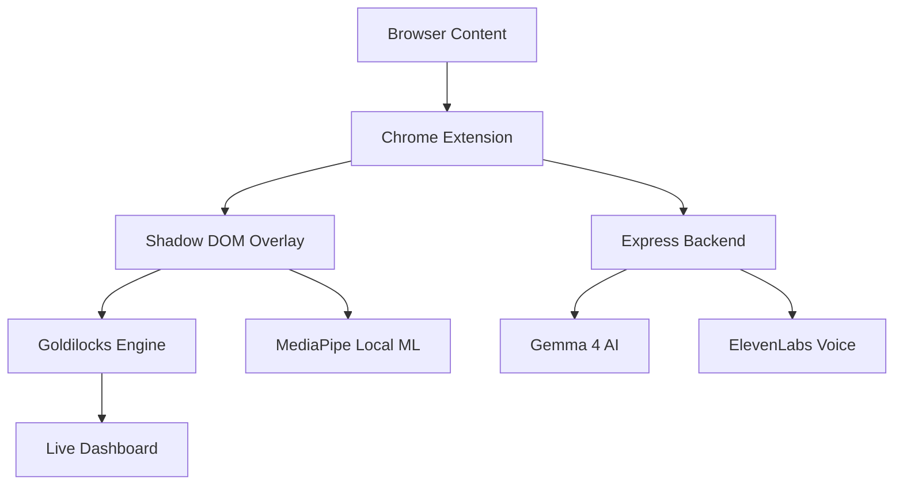

# SGT. CAPTCHA: The Reverse Turing Test

In 1950, Alan Turing proposed a test to see if a machine could pass as human. Today, we have the opposite problem. AI agents are becoming so good at mimicking us that they can solve standard CAPTCHAs in milliseconds. The internet is being flooded by entities that are too perfect, too fast, too efficient, too... inhumane. We can't stand idly by and watch this happen. 

So we decided to fight back by building a gatekeeper that hates perfection.

## Overview
SGT. CAPTCHA is a Chrome extension that acts as an unhinged AI Drill Sergeant. Unlike normal security measures, it does not just check if you are a dumb robot. It checks if you are an AI. By analyzing your biometrics in real-time, it looks for the Goldilocks Zone of humanness.

If you are too slow and dumb, you are a bot. If you are too fast and perfect, you are an AI. To pass, you must be a flawed, messy human.

## Why build this?
The original purpose of CAPTCHAs was to prevent bots from accessing the internet. Today, things like social media and online shopping attract humans like they're moths to a flame. The problem is that these platforms are designed to be addictive, and they're often used for mindless scrolling and wasted time. SGT. CAPTCHA is designed to be an interactive anti-addiction tool. It ensures your brain and body are not being lazy before you access the most addictive parts of the web.

While biometric behavioral analysis is a serious field of study, this project is not meant to be a perfect security solution. It is meant to be the most fun way to handle digital gatekeeping. By making the internet intentionally tedious, SGT. CAPTCHA acts as a high-friction productivity tool. You can enable it on sites where you spend too much time or money. Want to scroll social media? You must perform jumping jacks first. Want to shop impulsively? You must prove your humanity by solving impossible math. 

Gain back your humanity, one jump at a time.

## Key Features

### 1. Behavioral Analysis Engine
The Goldilocks Engine tracks mouse entropy, keystroke variance, and response latency. It calculates a live suspicion score based on how natural your movements are.

### 2. Physical Biometric Verification
Uses MediaPipe for real-time skeleton and hand tracking to force physical movement. Users must wave, salute, or perform jumping jacks to prove they have a physical body.

### 3. SGT. CAPTCHA AI
Powered by Google Gemini, the drill sergeant provides dynamic and emotionally escalating feedback. The system roasts your performance, analyzes your robotic tendencies, and provides a final behavioral debrief.

### 4. 7 Levels of Escalation
Challenges range from solving impossible math (where being right gets you banned) to a final boss fight with a fleeing submit button. Each level is designed to frustrate an AI and expose a bot.

## Technologies

### Extension and Core Logic
- **Manifest V3** : Modern Chrome extension architecture
- **Shadow DOM** : Isolated UI rendering to prevent website style interference
- **Goldilocks Engine** : Custom behavioral analysis engine for mouse and keyboard metrics
- **Vanilla JavaScript** : High performance logic without framework overhead

### Computer Vision and AI
- **MediaPipe** : Real time skeleton and hand tracking running locally in the browser
- **Google Gemini** : LLM for behavioral analysis, dynamic insults, and challenge generation
- **PoseLandmarker** : Skeleton tracking for squats and jumping jacks
- **HandLandmarker** : Hand tracking for gestures like waving and saluting

### Voice and Data
- **ElevenLabs** : AI voice generation for the drill sergeant personality
- **WebSockets/SSE** : Live data streaming from extension to behavioral dashboard
- **Express** : Node.js backend proxy for secure AI API orchestration

## Architecture



## Installation

### 1. Start the Backend
```bash
cd server
npm install
cp .env.example .env
# Add your API keys to .env
npm run dev
```

### 2. Install the Extension
1. Open Chrome and go to `chrome://extensions/`
2. Enable **Developer mode** in the top right.
3. Click **Load unpacked**.
4. Select the `extension` folder in this repository.